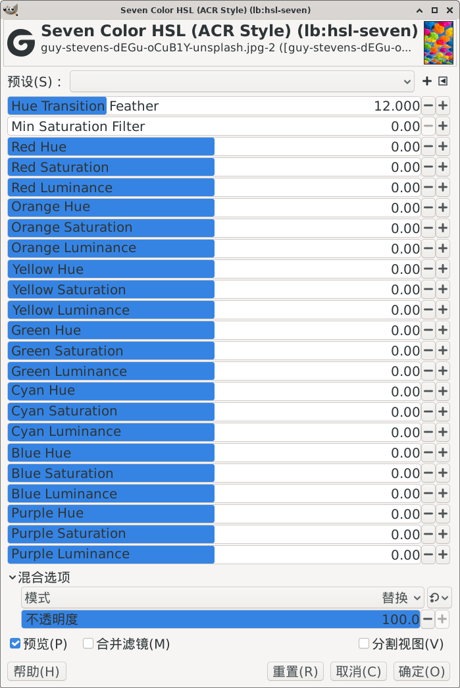

# GEGL_GIMP_PLUGIN_hslseven



## English

### 1. Compile & Install Commands

#### Native Linux (System installed GIMP)

```bash
sh build_linux.sh
cp build/gegl-*.so ~/.local/share/gegl-0.4/plug-ins
```

#### Flatpak Linux (Flatpak GIMP)

```bash
sh build_linux.sh
cp build/gegl-*.so ~/.var/app/org.gimp.GIMP/data/gegl-0.4/plug-ins/
```

### 2. How to Open the Plugin (2 Methods)

After installation, **restart GIMP** to activate the plugin.

#### Method 1: Menu Bar (Recommended)

Menu path: `Colors → myfilters → hslseven`

#### Method 2: GEGL Operation

1. Go to `Filters → Generic → GEGL Operations`
2. In the search box, enter: `hslseven`
3. Select it and click `OK` to apply

---

## 中文

### 1. 编译与安装命令

#### Linux 原生版（系统包安装的GIMP）

```bash
sh build_linux.sh
cp build/gegl-*.so ~/.local/share/gegl-0.4/plug-ins
```

#### Linux Flatpak 容器版（应用商店Flatpak GIMP）

```bash
sh build_linux.sh
cp build/gegl-*.so ~/.var/app/org.gimp.GIMP/data/gegl-0.4/plug-ins/
```

### 2. 插件打开方式（两种方法）

安装完成后**重启 GIMP**，插件即可使用。

#### 方法一：菜单打开（推荐）

菜单路径：`颜色 → myfilters → hslseven`

#### 方法二：GEGL 操作打开

1. 顶部菜单点击：`滤镜 → 通用 → GEGL 操作`
2. 在弹出窗口的搜索框输入：`hslseven`
3. 选中后点击「确定」即可使用插件
